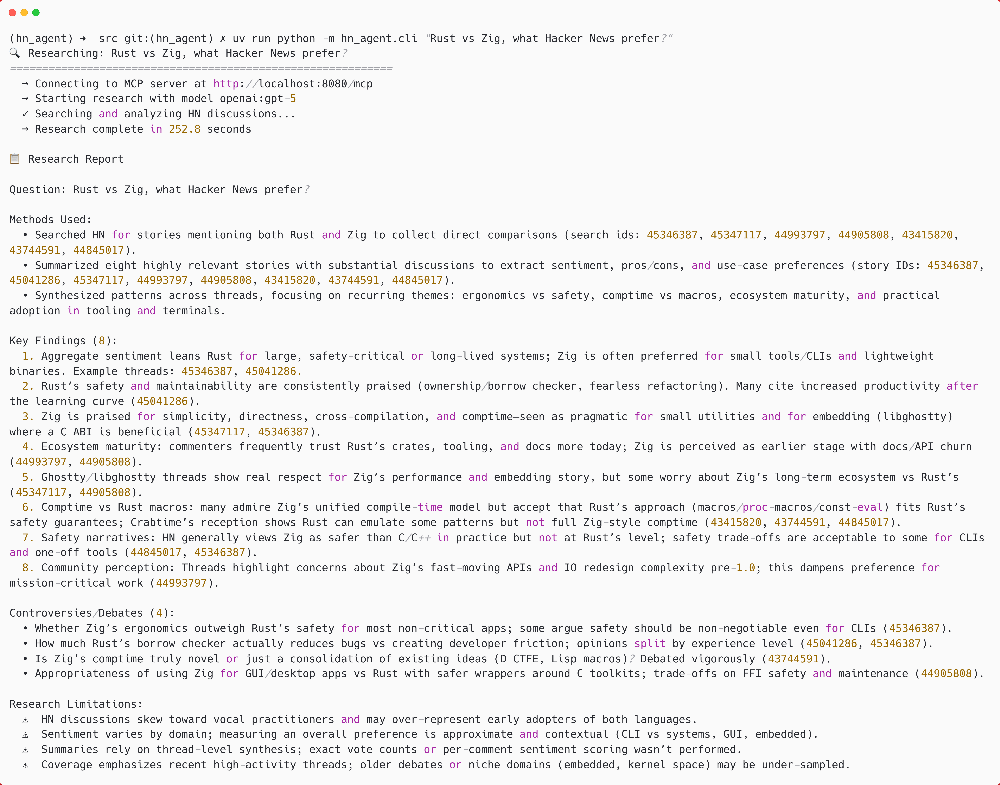

# HN Deep Research Agent

A deep research agent for Hacker News that uses AI to analyze discussions and extract insights from HN stories and comments.

This agent is built by combining together the power of fenic and Pydantic AI.

<div align="center">
  <h3>
    <a href="https://discord.com/invite/GdqF3J7huR">💬 Join Discord</a>
    &nbsp;&nbsp;&nbsp;|&nbsp;&nbsp;&nbsp;
    <a href="https://github.com/typedef-ai/fenic">⭐️ Check out fenic</a>
  </h3>
</div>



## What You Can Do

- **Deep Research on HN Discussions**: Ask complex questions and get synthesized answers from across hundreds of HN threads - "What do developers think about microservices in 2025?" or "What are the main criticisms of Rust?"

- **Discover Hidden Insights**: Find patterns and controversies across multiple discussions that you'd miss by reading individual threads - surface common themes, contradicting viewpoints, and emerging trends

- **Smart Story Discovery**: Search semantically across 2.5M comments and 500K stories using natural language, not just keywords - find relevant discussions even when they don't use your exact search terms

- **Instant Thread Summaries**: Get AI-generated summaries of any HN story's discussion with key themes, controversies, and action items - understand a 500-comment thread in seconds

- **Historical Analysis**: Research what the HN community discussed about any topic throughout 2025, tracking how opinions evolved over time

- **Citation-Backed Reports**: Every finding comes with source story IDs so you can verify claims and dive deeper into specific discussions

## Architecture

The project uses:

- **fenic**: PySpark-inspired DataFrame framework for data operations and MCP tooling
- **PydanticAI**: Agent framework for orchestrating research
- **Your favorite LLM**: For semantic analysis and summarization
- **HuggingFace**: For storing and retrieving the datasets

## Installation

### Prerequisites

- Python 3.11+
- [uv](https://github.com/astral-sh/uv) package manager
- OpenAI API key
- HuggingFace token (for dataset access)

### Setup

1. Clone the repository

2. Install dependencies with uv:
```bash
uv sync
```

3. Set up environment variables:
```bash
export OPENAI_API_KEY="your-openai-api-key"
export HF_TOKEN="your-huggingface-token"
```

## Usage

### 1. Load the HN Dataset

First, download and load the Hacker News dataset from HuggingFace:

```bash
HF_TOKEN=$HF_TOKEN uv run python -m hn_agent.data.loader
```

This downloads ~2.5M comments and ~500K stories from 2025 into a local DuckDB database at `src/assets/data/hn_agent.duckdb`.

**What happens during loading:**

1. Downloads 10 base tables from HuggingFace (items, comments, users, etc.)
2. **Denormalizes data** - Creates optimized lookup tables:
   - `comment_to_story` - Maps every comment to its root story (~2.5M rows)
   - `story_threads` - Precomputed thread structures with hierarchical paths (~2.8M rows)
   - `story_discussions` - Formatted markdown discussions with metadata (~287K rows)
3. These denormalized tables eliminate the need for recursive SQL queries during tool execution, significantly improving performance.

### 2. Run the MCP Server

Start the MCP server which automatically registers and exposes the tools via HTTP:

```bash
uv run python -m hn_agent.mcp.server
```

The server runs on `http://localhost:8080/mcp` and provides three tools:

- `search_stories`: Find stories by regex pattern
- `read_story`: Get full story with comment tree
- `summarize_story`: AI-powered discussion summary

### 3. Use the Research Agent

Run research queries using the CLI:

```bash
# Simple query
OPENAI_API_KEY=$OPENAI_API_KEY uv run python -m hn_agent.cli "What are concerns about AI safety?"

# With options
OPENAI_API_KEY=$OPENAI_API_KEY uv run python -m hn_agent.cli --max-stories 10 "Latest LLM developments"

# Output as JSON
OPENAI_API_KEY=$OPENAI_API_KEY uv run python -m hn_agent.cli --json "Rust vs Go discussions"

# Quiet mode (no progress spinner)
OPENAI_API_KEY=$OPENAI_API_KEY uv run python -m hn_agent.cli --quiet "Python trends"
```

## Project Structure

```
hn_agent/
├── src/hn_agent/
│   ├── agent/          # Research agent implementation
│   │   └── research.py  # PydanticAI agent for deep research
│   ├── data/           # Data loading and processing
│   │   ├── loader.py   # HuggingFace dataset loader
│   │   ├── denormalize.py  # Creates optimized lookup tables
│   │   └── format_threads.py  # Formats threads as markdown
│   ├── mcp/            # MCP server
│   │   └── server.py   # HTTP MCP server implementation
│   ├── tools/          # Tool definitions
│   │   ├── tools.py    # MCP tool registration
│   │   └── models.py   # Pydantic models for structured output
│   ├── session.py      # fenic session management
│   └── cli.py          # Command-line interface
└── assets/data/        # Local DuckDB storage (created on first run)
    └── hn_agent.duckdb  # DuckDB database file
```

## Available Tools

All tools use **denormalized lookup tables** for fast execution without recursive SQL queries.

### search_stories

Search across HN stories and comments using regex patterns:

```python
pattern: "(?i)(rust|golang|python)"  # Case-insensitive search
# Returns: Ranked stories with title, score, comment count
# Uses: comment_to_story lookup table
```

### read_story

Fetch complete story with comment hierarchy:

```python
story_id: 45389500
# Returns: Story metadata + all comments with depth/path structure
# Uses: story_threads precomputed hierarchy
```

### summarize_story

Generate AI summary of story discussion:

```python
story_id: 45389500
language: "en"  # Output language
extra_instructions: "Focus on technical details"
# Returns: Structured summary with themes, controversies, action items
# Uses: story_discussions formatted markdown
```

## Research Agent

The research agent uses GPT-5 (when available, falls back to GPT-4) to:

1. **Search** - Find relevant stories using multiple search queries
2. **Analyze** - Summarize the most relevant discussions
3. **Synthesize** - Extract patterns across multiple stories
4. **Report** - Generate structured findings with citations

Example output:

- Key findings with evidence
- Common themes across discussions
- Points of controversy
- Actionable insights
- Source citations (story IDs)

## Development

### Running Individual Components

```bash
# Load data (downloads + denormalizes)
HF_TOKEN=$HF_TOKEN uv run python -m hn_agent.data.loader

# Re-run only denormalization (if you already have base data)
uv run python -m hn_agent.data.denormalize

# Re-run only thread formatting
uv run python -m hn_agent.data.format_threads

# Start MCP server (automatically registers tools)
uv run python -m hn_agent.mcp.server

# Run research CLI
OPENAI_API_KEY=$OPENAI_API_KEY uv run python -m hn_agent.cli "Your research question"
```

### Python API

```python
from hn_agent.agent.research import run_research

# Run research programmatically
report = run_research("What are thoughts on remote work?")
print(report.key_findings)
print(report.themes)
print(report.sources)
```

## Opportunities for Improvement

Want to make this agent even better? Here are some interesting extensions you could implement:

### 1. Interactive Query Refinement
Add a conversational loop where the agent asks clarifying questions if the user's query is too broad or ambiguous. For example, if someone asks "What do people think about AI?", the agent could ask: "Are you interested in AI safety, AI in production, or AI tooling?" This would lead to more focused and useful research results.

### 2. Query Expansion & Diverse Search Strategies
Before searching, use an LLM to rephrase and expand the user's question into multiple diverse search queries. For example, "Rust vs Go" could expand into queries about performance comparisons, ecosystem maturity, learning curves, and production experiences. This encourages broader exploration and surfaces discussions the user might not have thought to search for.

### 3. Token Streaming for Real-Time Progress
Implement streaming output using PydanticAI's token streaming capabilities. Show users what the agent is thinking and discovering in real-time as it searches, analyzes, and synthesizes - similar to how ChatGPT streams responses. This makes the research process more transparent and engaging, especially for longer queries.

### 4. Add HN URLs to Citations
Enhance the source citations by including direct HN URLs for each story and comment reference. Instead of just showing story IDs, generate clickable links like `https://news.ycombinator.com/item?id=45389500`. This makes it trivial for users to verify claims and dive into the original discussions.

### 5. Multi-Year Historical Analysis
Extend the dataset beyond 2025 to include multiple years of HN data. This would enable true trend analysis - tracking how opinions on technologies, practices, or companies evolved over time. You could visualize sentiment changes, identify inflection points in community opinion, and spot emerging trends before they go mainstream.

### 6. Semantic Clustering of Discussions
Use fenic's semantic clustering capabilities to automatically group similar discussions together, even if they use different terminology. This could reveal that conversations about "remote work", "distributed teams", and "WFH culture" are actually part of the same broader discussion cluster.

## Credits

- Dataset: [HuggingFace Hacker News Dataset](https://huggingface.co/datasets/typedef-ai/hacker-news-dataset)
- Framework: [fenic](https://github.com/fenic-ai/fenic)
- Agent: [PydanticAI](https://github.com/pydantic/pydantic-ai)
